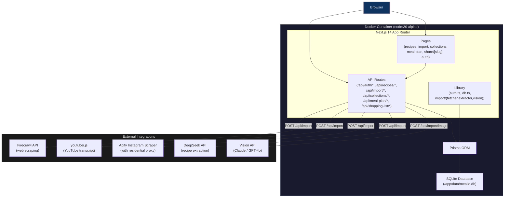

# Mealio

A self-hosted, multi-user recipe manager and meal planner. Paste a URL (YouTube, Instagram, TikTok, any recipe site) — AI extracts ingredients and steps automatically. Plan meals on a weekly calendar, build smart shopping lists, and share recipes with friends.

Built with **Next.js 14 (App Router)**, **Prisma + SQLite**, and **Docker**.

---

## Features

- **Recipe management** — full CRUD with structured ingredients, steps, timers, tags, hero images, and galleries
- **URL import** — paste a YouTube/Instagram/TikTok/recipe link; AI (DeepSeek) structures the result. YouTube uses `youtubei.js` Innertube; generic sites use Firecrawl
- **Camera / screenshot import** — barcode/QR scanner and vision extraction (Claude / GPT-4o)
- **Instagram import** — Apify Instagram Scraper with residential proxy (see [`docs/apify-instagram-fetcher.md`](docs/apify-instagram-fetcher.md))
- **Collections** — group recipes into custom categories (per-user)
- **Meal planning** — drag recipes onto a weekly calendar; auto-generates a categorized shopping list
- **Cook mode** — full-screen, step-by-step view with timers
- **Sharing** — public share links via unique slugs (no account required)
- **Auth** — email + password with scrypt-hashed passwords and HMAC-signed session cookies

## Tech Stack

| Layer | Technology |
|---|---|
| Framework | Next.js 14 (App Router) |
| Language | TypeScript |
| Styling | Tailwind CSS + glass-morphism tokens |
| Database | Prisma ORM + SQLite |
| Auth | scrypt password hashing, HMAC session cookies |
| AI Import | DeepSeek, Claude / GPT-4o vision |
| Scraping | Firecrawl, youtubei.js, Apify |
| Container | Docker (Node 20 Alpine) |

## Quick Start (Local Dev)

```bash
# 1. Clone and install
git clone https://github.com/andrewalhaj/mealio.git
cd mealio
npm install

# 2. Set environment (see below for required vars)
cp .env.example .env    # or create .env manually

# 3. Push schema to SQLite
npx prisma db push

# 4. Start dev server
npm run dev             # → http://localhost:3015
```

### Required Environment Variables

**In production `SESSION_SECRET` is mandatory** — the app throws on startup if unset.

| Variable | Required | Default | Description |
|---|---|---|---|
| `SESSION_SECRET` | **Yes** (prod) | `mealio-dev-secret-change-me` (dev) | HMAC signing key for session cookies |
| `DATABASE_URL` | No | `file:./prisma/dev.db` | SQLite connection string |
| `DEEPSEEK_API_KEY` | No | — | DeepSeek API key (recipe text extraction) |
| `FIRECRAWL_API_KEY` | No | — | Firecrawl API key (generic web scraping) |
| `VISION_API_KEY` | No | — | OpenAI vision API key (screenshot/photo import) |
| `VISION_MODEL` | No | `gpt-4o-mini` | Vision model override |
| `APIFY_API_KEY` | No | — | Apify API key (Instagram scraper) |

## Production (Docker)

```bash
# Build and run
docker compose up -d --build

# The container starts on port 3015
# SQLite data persists in ./data/ (gitignored)
```

Create a `.env.docker` file alongside `docker-compose.yml`:

```env
SESSION_SECRET=<generate-a-strong-random-secret>
DATABASE_URL=file:///app/data/mealio.db
DEEPSEEK_API_KEY=sk-...
FIRECRAWL_API_KEY=...
# … any other vars from the table above
```

The Docker entrypoint runs `prisma db push` at startup to apply the schema, then starts the Next.js server in standalone mode.

## Data

SQLite database files live in `data/` and are **gitignored** — each deployment gets its own database. See [`data/README.md`](data/README.md).

## Import Pipeline

When you paste a URL, the app detects the platform (YouTube, Instagram, generic), fetches the raw content (via `youtubei.js`, Firecrawl, or Apify), then sends it to DeepSeek for structured recipe extraction (title, ingredients, steps, timers, tags). A second pass searches for a hero image and fills in missing steps. Screenshot uploads bypass the fetch step and go directly to a vision model (Claude or GPT-4o). See [`docs/import-pipeline.md`](docs/import-pipeline.md) for full detail.

## Architecture



## Project Structure

```
mealio/
├── prisma/
│   └── schema.prisma          # Data model (User, Recipe, Ingredient, Step,
│                              #   Tag, Collection, MealPlanEntry, etc.)
├── src/
│   ├── app/
│   │   ├── api/               # REST routes (auth, recipes, import, etc.)
│   │   ├── recipes/           # Recipe list, detail, edit, cook mode
│   │   ├── import/            # Import page, review, history
│   │   ├── collections/       # Collection browser
│   │   ├── meal-plan/         # Weekly meal planning calendar
│   │   ├── share/[slug]/      # Public share view
│   │   └── login, forgot, reset, settings  # Auth pages
│   └── lib/
│       ├── auth.ts            # Session tokens, password hashing
│       ├── db.ts              # Prisma singleton
│       └── import/            # URL fetch, extraction, vision
├── docs/
│   ├── import-pipeline.md     # Import architecture & pitfalls
│   └── apify-instagram-fetcher.md  # Instagram scraper setup
├── docker-compose.yml
├── Dockerfile
├── docker-entrypoint.sh
└── package.json
```
